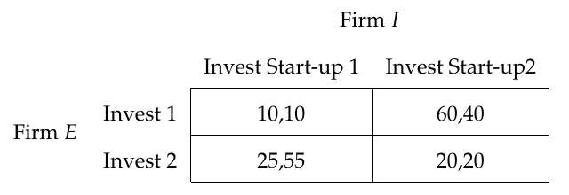
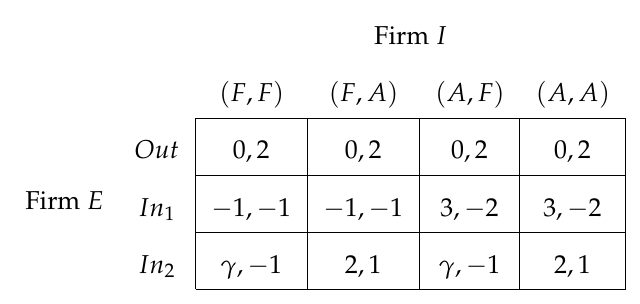

# Latex-Codes
Latex(Beginner)

# Font #

`mathptmx` This package defines Adobe Times Roman (or equivalent) as default text font, and provides maths support using glyphs from the Symbol, Chancery and Computer Modern fonts together with letters, etc., from Times Roman([CTAN](https://ctan.org/pkg/mathptmx?lang=en)).

`mathpazo` The Pazo Math fonts are a family of PostScript fonts suitable for typesetting mathematics in combination with the Palatino family of text fonts.([CTAN](https://ctan.org/pkg/mathpazo?lang=en)).

# Bibliography Style #

## APA Style
```Latex
\usepackage[style=apa, backend=biber, natbib=true]{biblatex}
\addbibresource{bib file name}

[contents]

\printbibliography
```

# Tables #

## Game Tables

<div id="Game_Tables">
<a href="./Codes_(Tables)/2by2_Game_Table.tex">

</a>
<a href="./Codes_(Tables)/3by4_Game_Table.tex">

</a>
</div>


# Hyperlink #

Using the `hyperref` package and its setup `hypersetup`, we can build hyper links.

```Latex
\usepackage{hyperref}
\hypersetup{
	colorlinks=true,
	linkcolor=black,
	filecolor=blue,      
	urlcolor=blue,
	citecolor=blue
}

\hypertarge{targetname}{target}
\hyperlink{targetname}{text}

```

# Theorems #

* `Solution` and qed sign at the end of the solution
```Latex

\newenvironment{solution}{\renewcommand{\proofname}{Solution}\begin{proof}}{\end{proof}}
\renewcommand\qedsymbol{$\blacksquare$}

```
